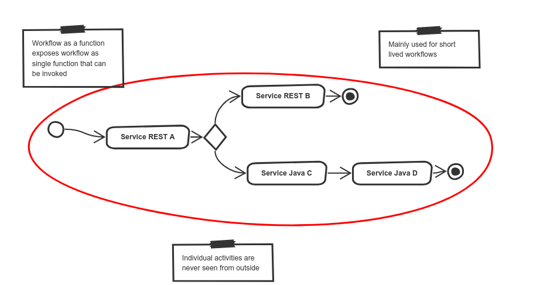

    Complete Automation for Workflows and Decision

#Overview

Automatiko is a toolkit that takes advantage of well established and known languages to build (but not limited to) self contained services. As the name might suggest its main goal is to enable users to automate their daily tasks, such as processing of emails, perform scheduled actions, collect and transform data and many more.

By "well established and known languages" Automatiko means:

- BPMN2 (Business Process Modeling and Notation)
- DMN (Decision Modeling and Notation)

In addition to these already known in the market, a relatively new player is also supported in Automatiko:

- Serverless Workflow (a Cloud Native Computing Foundation project)

Automatiko promotes the above mentioned languages as programming languages that can be used to build production ready services. It takes advantage of various constructs of these languages to provide services that are:

- self described
- API contract enabled
- secured
- easy to manage
- integrated with other services

## Want to know more? Visit our websites

- [Automatiko](https://automatiko.io)
- [Documentation](https://docs.automatiko.io)
- [Blog](https://blog.automatiko.io)
- [Examples](https://docs.automatiko.io/main/0.0.0/examples.html)
- [Getting started](https://docs.automatiko.io/main/0.0.0/getting-started.html)

# Concepts

## Workflow as a service

Workflow as a service brings an idea of modeling a service as a workflow. In this scenario a workflow is exposed as a fully featured service with a dedicated (domain specific) API. Workflow as a Service aims to cover more traditional service deployments that usually consists of:

- a service API exposed over http/rest
- an OpenAPI definition for describing services to simplify their use
- taking advantage of various integration mechanism to be able to exchange data with different services/systems
- ability to be either short lived or long running

Workflow as a Service does not really differ from any other developed service. The main advantage it provides is the ability to use the mentioned well established and known workflow languages such as BPMN and DMN as programing languages. Other features are for the most part very similar to those that could be coded by hand.

## Workflow as a function

Workflow as a Function is dedicated for short lived operations that usually last no longer that a second. They are expected to be fast and small in size both at runtime and at boot time.

Workflow as a Function typically targets deployments in more constrained environments such as:

- AWS Lambda
- Google Functions
- Azure Functions

however are not strictly limited to them, as they can easily be invoked over HTTP with both POST and GET endpoints, making them deployable virtually anywhere.

## Workflow as a function flow

Workflow as Function Flow is a more advanced extension to Workflow as a Function which breaks the workflow into many different functions.

A function, in workflow terms, is a single executing activity. This single activity can be grouped with other activities that do not actually perform work but can be one of the following:

- start or end of the workflow
- control logic (gateways)
- pass-through activities

Workflow as a Function Flow targets deployments to Knative based environment as it utilizes Knative eventing

# Use case for Automatiko

## Event streams

Event streams are very popular for representing data changes. They allow individual modifications to be represented as atomic operations that:

- are associated with a timestamp
- are uniquely identifiable
- carry all relevant information to the objects they reference

Workflows are a perfect fit for processing event streams as they can logically express data changes in terms of business logic specific to the target domain.

## Internet of Things (IoT)

Workflows provide a very natural fit to solving problems in the IoT domain. Workflow business logic can provide significant additional value to data produced by different sensors (data which might have little value on its own).

## Human-centric workflows

Human-centric workflows is one of the most common use cases for workflows. Ability to involve human interaction during workflow execution was often promoted by traditional Business Process Management (BPM) solutions and indeed, it is still a valid use case as human interactions are present/needed in literally every business solution. Things like vacation approvals, loan and insurance applications are just few examples of business solutions that need human interactions.

## Service orchestration

Service orchestration is another traditional use case coming from SOA (Service Oriented Architecture) times. Although it’s somewhat dated, it is certainly still relevant. It might be even more relevant now with the rise of microservices and event driven architectures.

These architectures focus on communication between services, despite what communication protocol is used (REST/HTTP, messaging, other). There is always a need to coordinate this communication.

## Database record processing
As we know most of the data systems deal with is stored in databases. Regardless of their type, this data is always a subject to modification. Systems have to create, read, update and delete data stored in databases. In most cases this logic is custom but has a well defined life cycle. This life cycle is defined by business context it resides in. All this is is actually a defined process that governs how and by whom data can be modified.

## Batch processing
Batch processing is usually expressed as set of steps that need to happen to process a given item. This makes a perfect fit for expressing it as a workflow.

Batch processing can have different trigger mechanisms:

- time based e.g. every Friday night, or every day etc
- trigger based e.g. file has been put into a folder
- manual e.g. user action triggers batch processing in background

## Kubernetes Operator

Kubernetes operators are becoming more and more popular. In most of the cases their logic is a sequence of steps that must be performed to provision particular service. Operators are sort of watchers around custom resources and react to following change events

- custom resource created
- custom resource updated
- custom resource deleted

Essentially possibility to express operator logic as a workflow provides direct insights into what a given operator does and what resources it has managed. Combined with capabilities of workflows e.g. isolation, error handling, retries, compensation, times and many more it makes a great fit for building Kubernetes operators.

# Become part of Automatiko

It's easy to be part of Automatiko, just have a look at our [contributors](CONTRIBUTING.md) guide and start already today!
