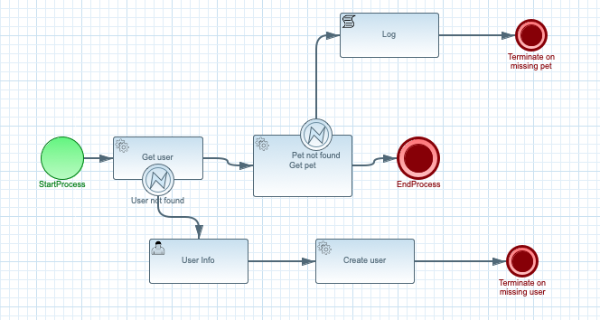

# Automatik REST invocation

## Description

A quickstart project is a simple example illustrating interaction over REST.

This example shows

* invoking REST from within process - GET and POST
	
It uses the PetStore service to showcase that importing a OpenAPI definition and selecting operations from it
is all that it takes to interact with REST services from Automatik.
	
<p align="center"></p>


## Build and run

### Prerequisites
 
You will need:
  - Java 11.0+ installed 
  - Environment variable JAVA_HOME set accordingly
  - Maven 3.5.4+ installed

When using native image compilation, you will also need: 
  - GraalVM 20.1+ installed
  - Environment variable GRAALVM_HOME set accordingly
  - Note that GraalVM native image compilation typically requires other packages (glibc-devel, zlib-devel and gcc) to be installed too, please refer to GraalVM installation documentation for more details.

### Compile and Run in Local Dev Mode

```
mvn clean quarkus:dev    
```

NOTE: With dev mode of Quarkus you can take advantage of hot reload for business assets like processes, rules, decision tables and java code. No need to redeploy or restart your running application.


### Compile and Run using Local Native Image
Note that this requires GRAALVM_HOME to point to a valid GraalVM installation

```
mvn clean package -Pnative
```
  
To run the generated native executable, generated in `target/`, execute

```
./target/automatik-rest-{version}-runner
```

### Use the application

Examine OpenAPI via swagger UI at [http://localhost:8080/swagger-ui](http://localhost:8080/swagger-ui)


### Submit a request

To make use of this application it is as simple as sending request to `http://localhost:8080/scripts`  with following content 

```
{
"userName" "john",
"petId" : 123
}

```

Complete curl command can be found below:

```
curl -X POST "http://localhost:8080/users" -H  "accept: application/json" -H  "Content-Type: application/json" -d "{\"petId\":123,\"userName\":\"john\"}"
```

It will call `/users` endpoint of PetStore to find user by given username.

If not found (that results in 404 response code) it takes alternative path in the process and creates 
user task that allows to create user in PetStore.

To get user tasks

```
curl -X GET "http://localhost:8080/users/{id}/tasks" -H  "accept: application/json"
```

where `id` is the id assigned during create operation.

it will result in something similar to

```
[
  {
    "id": "7a24dc14-03c2-47cc-9928-b9c9986263f2",
    "name": "userinfo",
    "reference": "users/eabcad6a-85ec-4851-8bf0-17b0d91a840e/userinfo/7a24dc14-03c2-47cc-9928-b9c9986263f2"
  }
]

```


To create a user complete the task with following content

```
{
  "info": {
    "email": "john@email.com",
    "firstName": "John",
    "lastName": "Doe",
    "password": "aaaa",
    "phone": "12345",
    "userStatus": 0,
    "username": "john"
  }
}
```

here is a complete curl command for that

```
curl -X POST "http://localhost:8080/users/{id}/userinfo/{taskId}?phase=complete" -H  "accept: application/json" -H  "Content-Type: application/json" -d "{\"info\":{\"email\":\"john@email.com\",\"firstName\":\"John\",\"lastName\":\"Doe\",\"password\":\"aaaa\",\"phone\":\"12345\",\"userStatus\":0,\"username\":\"john\"}}"
```

where `id` and `taskId` are the id assigned during create operation and task id.