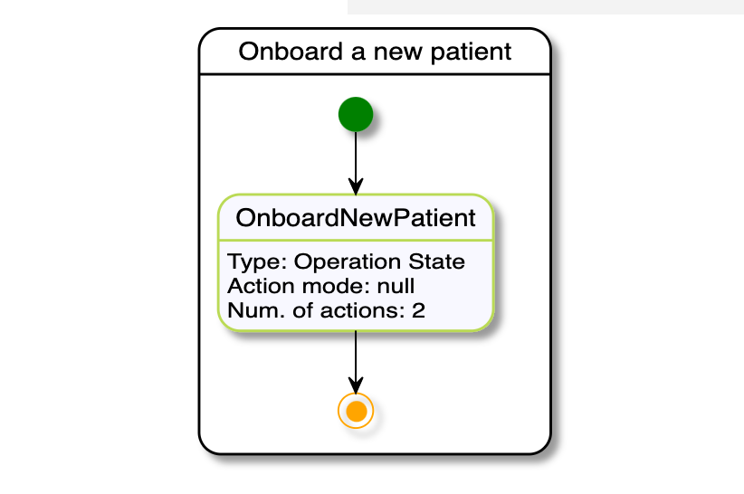

# Automatik Serverless Workflow REST invocation

## Description

A quickstart project is a simple example illustrating interaction over REST using Serverless Workflow language.

This example shows

* invoking REST from within serverless workflow - POST
	
<p align="center"></p>

## Build and run

### Prerequisites
 
You will need:
  - Java 11.0+ installed 
  - Environment variable JAVA_HOME set accordingly
  - Maven 3.5.4+ installed

When using native image compilation, you will also need: 
  - GraalVM 20.1+ installed
  - Environment variable GRAALVM_HOME set accordingly
  - Note that GraalVM native image compilation typically requires other packages (glibc-devel, zlib-devel and gcc) to be installed too, please refer to GraalVM installation documentation for more details.

### Compile and Run in Local Dev Mode

```
mvn clean quarkus:dev -DskipTests -Dgeneratedapi/mp-rest/url=http://localhost:8080  
```

NOTE: With dev mode of Quarkus you can take advantage of hot reload for business assets like processes, rules, decision tables and java code. No need to redeploy or restart your running application.


### Compile and Run using Local Native Image
Note that this requires GRAALVM_HOME to point to a valid GraalVM installation

```
mvn clean package -Pnative
```
  
To run the generated native executable, generated in `target/`, execute

```
./target/automatik-rest-{version}-runner
```

### Use the application

Once the application has started you can havigate to [`http://localhost:800`](http://localhost:8080)
to access the demo page:

<p align="center"></p>

Enter any number is the new patient id.
Enter any name as the patient name.
Enter any of the following as the patient condition: "irregular heart beat", "bladder infection", "breathing problems".
Press the "ONBOARD" button to start workflow execution. 
The new patient information will be automatically displayed in the table below the new patient form once the
workflow has finished execution.
